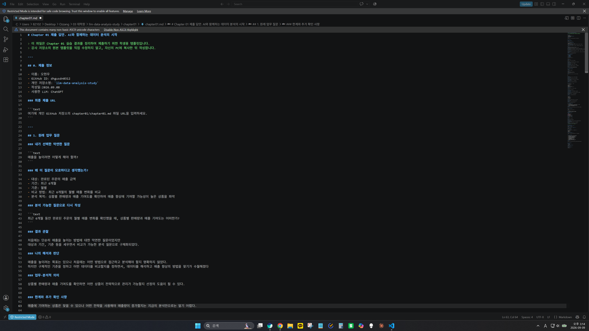
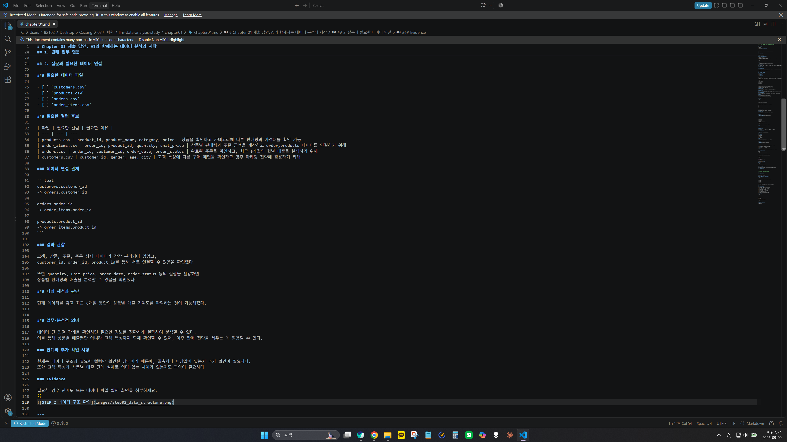
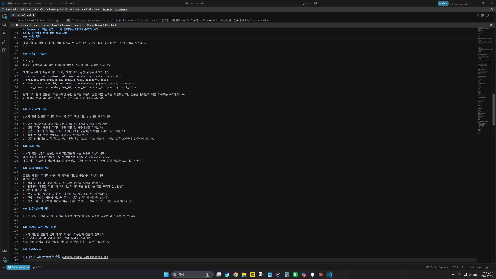
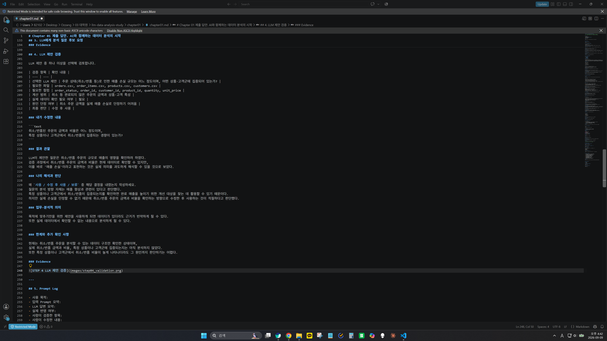
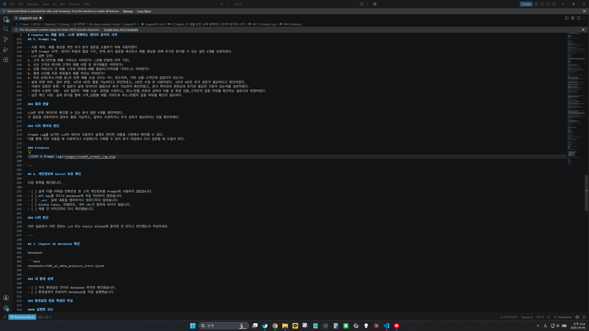

# Chapter 01 제출 답안. AI와 함께하는 데이터 분석의 시작

> 이 파일은 Chapter 01 실습 결과를 정리하여 제출하기 위한 학생용 템플릿입니다.  
> 강사 저장소의 원본 템플릿을 직접 수정하지 말고, 자신의 PC에 복사한 뒤 작성합니다.

---

## 0. 제출 정보

- 이름: 오현우
- GitHub ID: dhgusdn0312
- 개인 저장소명: `llm-data-analysis-study`
- 작성일:2026.09.08
- 사용한 LLM: ChatGPT

### 최종 제출 URL

```text
여기에 개인 GitHub 저장소의 chapter01/chapter01.md 파일 URL을 입력하세요.
```

---

## 1. 원래 업무 질문

### 내가 선택한 막연한 질문

```text
매출을 높이려면 어떻게 해야 할까?
```

### 왜 이 질문이 모호하다고 생각했는가?

- 대상: 완료된 주문의 매출 금액
- 기간: 최근 6개월
- 기준: 월별
- 비교 방법: 최근 6개월의 월별 매출 변화를 비교
- 분석 목적: 상품별 판매량과 매출 기여도를 확인하여 매출 향상에 기여할 가능성이 높은 상품을 파악

### 분석 가능한 질문으로 다시 작성

```text
최근 6개월 동안 완료된 주문의 월별 매출 변화를 확인했을 때, 상품별 판매량과 매출 기여도는 어떠한가?
```

### 결과 관찰

처음에는 단순히 매출을 높이는 방법에 대한 막연한 질문이었지만
대상과 기간, 기준 등을 세우면서 비교가 가능한 분석 질문으로 구체화되었다.

### 나의 해석과 판단

매출을 높이려는 목표는 있으나 처음에는 어떤 방법으로 접근하고 분석해야 할지 명확하지 않았다.
하지만 구체적인 기준을 정하고 어떤 데이터를 비교할지를 정하면서, 데이터를 해석하고 매출 향상의 방법을 찾기가 수월해졌다

### 업무·분석적 의미

상품별 판매량과 매출 기여도를 확인하면 어떤 상품이 전략적으로 관리가 가능할지 선정의 도움이 될 수 있다.


### 한계와 추가 확인 사항

매출에 기여하는 상품은 찾을 수 있으나 어떤 전략을 사용해야 매출량이 증가할지는 지금의 분석만으로는 알기 어렵다.

### Evidence



---

## 2. 질문과 필요한 데이터 연결

### 필요한 데이터 파일

- [O] `customers.csv`
- [O] `products.csv`
- [O] `orders.csv`
- [O] `order_items.csv`

### 필요한 컬럼 후보

| 파일 | 필요한 컬럼 | 필요한 이유 |
| --- | --- | --- |
| products.csv | product_id, product_name, category, price | 상품을 확인하고 카테고리에 따른 판매량과 가격대를 확인 가능
| order_items.csv | order_id, product_id, quantity, unit_price | 상품별 판매량과 주문 금액을 계산하고 order,products 데이터를 연결하기 위해
| orders.csv | order_id, customer_id, order_date, order_status | 완료된 주문을 확인하고, 최근 6개월의 월별 매출을 분석하기 위해
| customers.csv | customer_id, gender, age, city | 고객 특성에 따른 구매 패턴을 확인하고 향후 마케팅 전략에 활용하기 위해

### 데이터 연결 관계

```text
customers.customer_id
-> orders.customer_id

orders.order_id
-> order_items.order_id

products.product_id
-> order_items.product_id
```

### 결과 관찰

고객, 상품, 주문, 주문 상세 데이터가 각각 분리되어 있었고,
customer_id, order_id, product_id를 통해 서로 연결할 수 있음을 확인했다.

또한 quantity, unit_price, order_date, order_status 등의 컬럼을 활용하면
상품별 판매량과 매출을 분석할 수 있음을 확인했다.

### 나의 해석과 판단

현재 데이터를 갖고 최근 6개월 동안의 상품별 매출 기여도를 파악하는 것이 가능해졌다.


### 업무·분석적 의미

데이터 간 연결 관계를 확인하면 필요한 정보를 정확하게 결합하여 분석할 수 있다.
이를 통해 상품별 매출뿐만 아니라 고객 특성까지 함께 확인할 수 있어, 이후 판매 전략을 세우는 데 활용할 수 있다.

### 한계와 추가 확인 사항

현재는 데이터 구조와 필요한 컬럼만 확인한 상태이기 때문에, 결측치나 이상값이 있는지 추가 확인이 필요하다.
또한 고객 특성과 상품별 매출 간에 실제로 의미 있는 차이가 있는지도 파악이 필요하다

### Evidence

필요한 경우 관계도 또는 데이터 파일 확인 화면을 첨부하세요.



---

## 3. LLM에게 분석 질문 후보 요청

### 사용 목적

```text
매출 향상을 위해 현재 데이터를 활용할 수 있는 분석 방향과 질문 후보를 얻기 위해 LLM을 사용했다.
```

### 사용한 Prompt

```text
온라인 쇼핑몰의 데이터를 분석하여 매출을 높이기 위한 방법을 찾고 싶어.

데이터는 4개의 파일로 되어 있고, 데이터마다 컬럼 구성은 아래와 같아
- customers.csv: customer_id, name, gender, age, city, signup_date
- products.csv: product_id, product_name, category, price
- orders.csv: order_id, customer_id, order_date, payment_method, order_status
- order_items.csv: order_item_id, order_id, product_id, quantity, unit_price

현재 나의 분석 질문은 “최근 6개월 동안 완료된 주문의 월별 매출 변화를 확인했을 때, 상품별 판매량과 매출 기여도는 어떠한가?”야.
이 목적과 현재 데이터로 확인할 수 있는 분석 질문 5개를 제안해줘.
```

### LLM 답변 요약

LLM의 전체 답변을 그대로 복사하지 말고 핵심 제안 3~5개를 요약하세요.

1. 고객 세그먼트별 매출 기여도는 어떠한가? (성별·연령대·지역 기준)
2. 신규 고객과 재구매 고객의 매출 비중 및 재구매율은 어떠한가?
3. 상품 카테고리 간 매출 구조와 판매량-매출 불일치(가격대별 기여도)는 어떠한가?
4. 결제 수단별 주문 완료율과 매출 차이는 어떠한가?
5. 주문 상태(취소/반품 등)로 인한 매출 손실 규모는 어느 정도이며, 어떤 상품·고객군에 집중되어 있는가?

### 결과 관찰

LLM이 어떤 방향의 질문을 주로 제안했는지 사실 위주로 작성하세요.
매출 향상을 목표로 영향을 줄만한 항목들을 파악하고 분석하려고 하였다.
매출 기여한 고객의 정보에 초첨을 맞추었고, 결제 수단과 주문 상태 등의 정보들 또한 활용하였다.

### 나의 해석과 판단

좋았던 제안과 그대로 사용하기 어려운 제안을 구분해서 작성하세요.
좋았던 제안 :
1. 성별,연령대 별 매출 기여도 파악으로 전략을 짜기에 용이하다.
3. 판매량과 매출을 확인하여 가격대별로 기여도를 판단하는 것은 목적에 잘부합한다.
사용하기 어려운 제안 :
2. 신규 고객과 재구매 고객 파악이 어려움. 재구매율 파악이 어렵다.
4. 결제 수단으로 매출에 영향을 준다는 것은 납득하기 어려움 부분이다.
5. 반품, 취소의 구분이 있는지 확인이 필요. 반품/취소가 매출 손실로 이어진다는 것이 맞지 않아보임

### 업무·분석적 의미

LLM은 분석 초기에 다양한 관점의 질문을 제안하여 분석 방향을 넓히는 데 도움을 줄 수 있다.


### 한계와 추가 확인 사항

LLM이 제안한 질문이 실제 데이터로 분석 가능한지 검증이 필요하다.
신규 고객과 재구매 고객의 기준, 반품 상태의 존재 여부,
취소 주문 금액을 매출 손실로 해석할 수 있는지 추가 확인이 필요하다.

### Evidence



---

## 4. LLM 제안 검증

LLM 제안 중 하나 이상을 선택해 검토합니다.

| 검증 항목 | 확인 내용 |
| --- | --- |
| 선택한 LLM 제안 | 주문 상태(취소/반품 등)로 인한 매출 손실 규모는 어느 정도이며, 어떤 상품·고객군에 집중되어 있는가? |
| 필요한 파일 | orders.csv, order_items.csv, products.csv, customers.csv |
| 필요한 컬럼 | order_status, order_id, customer_id, product_id, quantity, unit_price |
| 계산 범위 | 취소 등 완료되지 않은 주문의 금액과 상품·고객 특성 |
| 실제 데이터 확인 필요 여부 | 필요 |
| 원인 단정 여부 | 취소 주문 금액을 실제 매출 손실로 단정하기 어려움 |
| 최종 판단 | 수정 후 사용 |

### 내가 수정한 내용

```text
취소/반품된 주문의 금액과 비율은 어느 정도이며,
특정 상품이나 고객군에서 취소/반품이 집중되는 경향이 있는가?
```

### 결과 관찰

LLM이 제안한 질문은 취소/반품 주문의 규모로 매출의 영향을 확인하려 하였다.
검증 과정에서 취소/반품 주문의 금액과 비율은 현재 데이터로 확인할 수 있지만,
이를 바로 '매출 손실'이라고 표현하는 것은 실제 의미를 과도하게 해석할 수 있을 것으로 보았다.

### 나의 해석과 판단

왜 `사용 / 수정 후 사용 / 보류` 중 해당 결정을 내렸는지 작성하세요.
질문의 분석 방향 자체는 매출 향상과 관련이 있다고 판단했다.
특정 상품이나 고객군에서 취소/반품이 집중되는지를 확인하면 완료 매출을 높이기 위한 개선 대상을 찾는 데 활용할 수 있기 때문이다.
하지만 실제 손실을 단정할 수 없기 때문에 취소/반품 주문의 금액과 비율을 확인하는 방향으로 수정한 후 사용하는 것이 적절하다고 판단했다.

### 업무·분석적 의미

목적에 맞추기만을 위한 제안을 사용하개 되면 데이터가 있더라도 근거가 빈약하게 될 수 있다.
또한 실제 데이터에서 확인할 수 없는 내용으로 분석하게 될 수 있다.


### 한계와 추가 확인 사항

현재는 취소/반품 주문을 분석할 수 있는 데이터 구조만 확인한 상태이며,
실제 취소/반품 금액과 비율, 특정 상품이나 고객군에 집중되는지는 아직 분석하지 않았다.
또한 특정 상품이나 고객군에서 취소/반품 비율이 높게 나타나더라도 그 원인까지 판단하기는 어렵다.

### Evidence



---

## 5. Prompt Log

- 사용 목적: 매출 향상을 위한 추가 분석 질문을 도출하기 위해 사용하였다.
- 입력 Prompt 요약: 데이터 파일과 컬럼 구조, 현재 분석 질문을 제시하고 매출 향상을 위해 추가로 분석할 수 있는 질문 5개를 요청하였다.
- LLM 답변 요약:
1. 고객 세그먼트별 매출 기여도는 어떠한가? (성별·연령대·지역 기준)
2. 신규 고객과 재구매 고객의 매출 비중 및 재구매율은 어떠한가?
3. 상품 카테고리 간 매출 구조와 판매량-매출 불일치(가격대별 기여도)는 어떠한가?
4. 결제 수단별 주문 완료율과 매출 차이는 어떠한가?
5. 주문 상태(취소/반품 등)로 인한 매출 손실 규모는 어느 정도이며, 어떤 상품·고객군에 집중되어 있는가?
- 실제 반영 여부: 일부 반영. 1번과 3번은 활용 가능하다고 판단하였고, 5번은 수정 후 사용하였다. 2번과 4번은 추가 검토가 필요하다고 판단하였다.
- 사람이 검증한 항목: 각 질문이 실제 데이터의 컬럼으로 분석 가능한지 확인하였고, 분석 목적과의 관련성과 추가로 필요한 기준이 있는지를 검토하였다.
- 사람이 수정한 내용:  5번 질문의 '매출 손실' 표현을 수정하고, 취소/반품 주문의 금액과 비율 및 특정 상품,고객군의 집중 여부를 확인하는 질문으로 변경하였다.
- 남은 확인 사항: 실제 분석을 통해 고객,상품별 매출 기여도와 취소/반품의 집중 여부를 확인이 필요하다.

### 결과 관찰

LLM은 현재 데이터로 확인할 수 있는 분석 질문 5개를 제안하였다.
각 질문을 검토하면서 일부는 활용 가능하고, 일부는 수정하거나 추가 검토가 필요하다는 것을 확인하였다.

### 나의 해석과 판단

Prompt Log를 남기면 LLM의 제안과 사용자가 실제로 판단한 내용을 구분해서 확인할 수 있다.
이를 통해 어떤 내용을 왜 사용하거나 수정했는지 기록할 수 있어 분석 과정에서 다시 검토할 때 도움이 된다.

### Evidence



---

## 6. 개인정보와 Secret 보호 확인

다음 항목을 확인합니다.

- [O] 실제 이름·이메일·전화번호 등 고객 개인정보를 Prompt에 사용하지 않았습니다.
- [O] API Key를 코드나 Notebook에 직접 작성하지 않았습니다.
- [O] `.env` 실제 내용을 캡처하거나 업로드하지 않았습니다.
- [O] GitHub Token, 비밀번호, 내부 URL이 캡처에 보이지 않습니다.
- [O] 제출 전 이미지까지 다시 확인했습니다.

### 나의 판단

고객 개인정보와 API Key, 비밀번호 등의 정보는
외부에 공개될 경우 정보 유출이나 무단 사용으로 이어질 수 있어서 올리면 안된다고 판단된다.

---

## 7. Chapter 01 Notebook 확인

Notebook:

```text
notebooks/ch01_ai_data_analysis_intro.ipynb
```

### 내 환경 상태

- [ ] 아직 환경설정 전이라 Notebook 위치만 확인했습니다.
- [ ] 환경설정이 완료되어 Notebook을 직접 실행했습니다.

### 환경설정 완료 학생만 작성

#### 실행한 코드

```python
from pathlib import Path

import pandas as pd
import numpy as np
import matplotlib.pyplot as plt
import seaborn as sns

DATA_DIR = Path('../data/raw')
sns.set_theme(style='whitegrid')
```

#### 실행 결과

```text
오류 없이 실행되었는지 작성하세요.
```

#### 결과 관찰

실행 결과에서 확인한 사실을 작성하세요.

#### 나의 해석과 판단

현재 Notebook이 본격 분석이 아니라 starter scaffold라는 의미를 자신의 말로 설명하세요.

#### 한계와 추가 확인 사항

Chapter 02 또는 Chapter 03에서 추가로 확인해야 할 내용을 작성하세요.

#### Evidence


> 환경설정 전이라면 이 이미지는 생략할 수 있습니다.

---

## 8. Chapter 01 최종 해석

### 이번 장에서 가장 중요하다고 생각한 내용

```text
자신의 말로 3~5문장 작성하세요.
데이터 분석에서 앞서서 어떤 질문을 해야할지에 대해서 고민해보았다.
구체화할 수 있는 좋은 질문을 하여야 목적이 분명해지고 필요한 정보들이 무엇인지 가려낼 수 있다.
모든 데이터를 다 활용하는 것이 아닌 필수적이고 효과적인 데이터를 사용하는 것이 중요하다.
또한 LLM을 활용하여 데이터 분석을 진행하는 것은 시야를 넓게 확장시켜준다.
하지만 그 제안된 방법들이 맞는지 아닌지를 결국엔 사람이 최종판단하는 것이 매우 종요한다. 

```

### LLM을 데이터 분석에 사용할 때 가장 조심해야 할 점

```text
자신의 판단을 작성하세요.
LLM은 내가 준 정보를 기반으로 확장성 있게 내용들을 만들어준다.
프롬프트를 어떻게 작성하냐에 따라 대답도 천차만별이다.
좋은 질문을 하는 것도 중요하지만 그 대답을 잘 활용하는 것 또한 사용자의 중요 역량이다.
검증 없이 정보를 사용하개 된다면 잘못된 정보까지 사용하게 될 수 있다.
그 정보가 어떤 기준으로 제공된 것인지 확인하고 필요에 따라 수정 작업을 해야한다.
```

### 사람과 LLM의 역할 차이

| 항목 | LLM이 도울 수 있는 부분 | 사람이 책임져야 하는 부분 |
| --- | --- | --- |
| 질문 정의 | 다양한 분석 질문과 관점을 제안 | 분석 목적에 맞는 질문인지 판단 |
| 데이터 확인 | 필요한 데이터를 빠르게 읽고 후보를 제안 | 실제 데이터가 맞는지 활용 가능한지를 확인 |
| 코드 작성 | 분석에 필요한 코드의 초안이나 예시를 제안 | 코드가 목적에 맞게 짜여있는지 검증 |
| 결과 해석 | 결과에서 확인할 수 있는 의미와 추가 분석 방향을 제안 | 과도한 해석은 없는지 실제 데이터가 의미하는 방향과 같은지 판단 |
| 최종 판단 | 가능한 선택지 제시 | 실제 사용 여부와 최종적인 의사를 결정 |

### 다음 Chapter에서 확인하고 싶은 것

```text
데이터 전처리와 코딩
```

---

## 9. 최종 제출 체크리스트

- [O] 원래 업무 질문과 구체화한 분석 질문을 작성했습니다.
- [O] 질문에 필요한 데이터 파일과 컬럼 후보를 정리했습니다.
- [O] LLM Prompt와 답변 요약을 작성했습니다.
- [O] LLM 제안을 실제 데이터 관점에서 검증했습니다.
- [O] 각 핵심 STEP의 결과 관찰을 작성했습니다.
- [O] 각 핵심 STEP의 나의 해석과 판단을 작성했습니다.
- [O] 업무·분석적 의미를 작성했습니다.
- [O] 한계와 추가 확인 사항을 작성했습니다.
- [O] 핵심 실행 Evidence 이미지를 첨부했습니다.
- [O] 이미지가 Markdown에서 정상 표시됩니다.
- [O] 개인정보가 없습니다.
- [O] API Key·Secret·Token이 없습니다.
- [O] 개인 GitHub 저장소에 업로드했습니다.
- [O] GitHub에서 Markdown과 이미지가 정상 표시됩니다.
- [O] 아래 최종 파일 URL이 정상적으로 열립니다.

### 최종 파일 URL

```text
https://github.com/<내-GitHub-ID>/llm-data-analysis-study/blob/main/chapter01/chapter01.md
```

---

## 10. 교수자 확인용 요약

### 수행 상태

- [O] COMPLETE
- [ ] PARTIAL

### 내가 가장 중요하게 내린 판단 1개

```text
LLM이 제시하는 분석 방법을 다양하게 활용은 하되 목적에 적합한지 검증하고 필요에 따라 수정하여 사용해야한다.
```

### 아직 확인이 필요한 내용 1개

```text
나의 분석 질문과 LLM의 분석 질문을 통하여 목적을 달성하는데 얼마나 효과적일지 확인이 필요하다.
```
