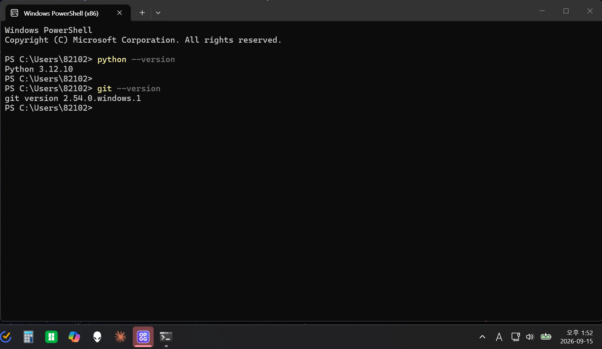
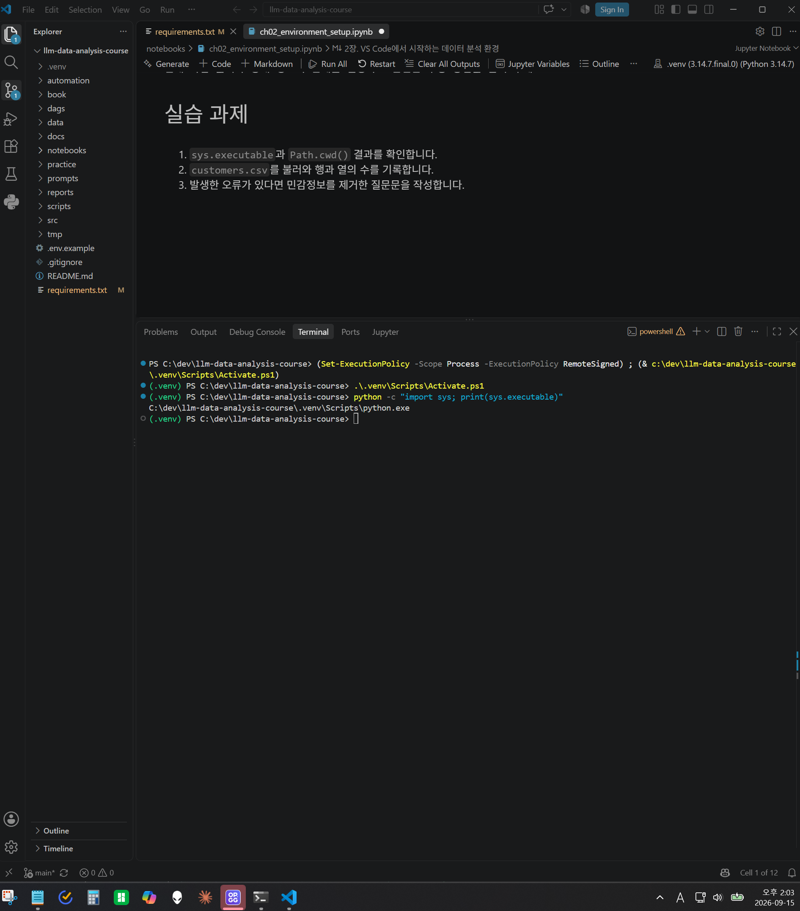
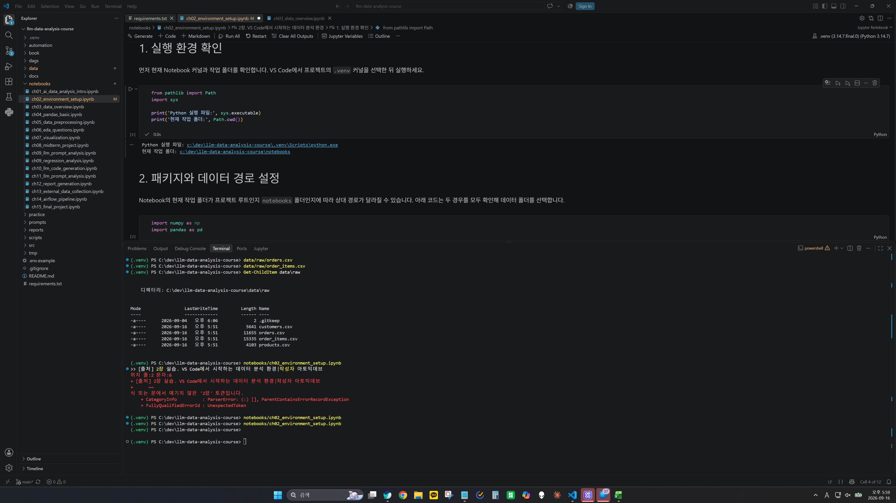
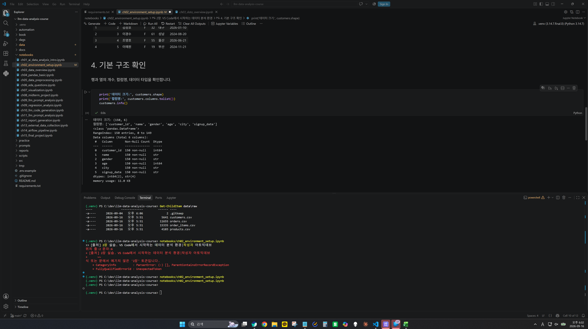
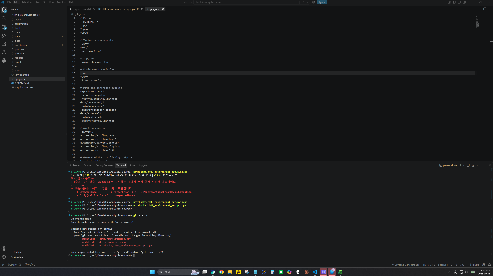

# Chapter 02 제출 답안. VS Code에서 시작하는 데이터 분석 환경

> 최종 파일은 개인 GitHub 저장소의 `chapter02/chapter02.md`로 저장하는 것을 권장합니다.

## 0. 제출 정보

- 이름: 오현우
- GitHub ID: dhgusdn0312
- 개인 저장소: `llm-data-analysis-study`
- 작성일: 2026.09.16
- 운영체제: windows

### 최종 제출 URL

```text
https://github.com/dhgusdn0312/llm-data-analysis-study/blob/main/chapter02/chapter02.md
```

---

## 1. Python과 Git 환경 확인

### 실행 내용

```text
python --version
git --version
```

### 실행 결과

```text
Python 3.14.7
git version 2.54.0.windows.1
```

### Evidence



### 결과 관찰

PowerShell에서 Python 3.14.7과 Git 2.54.0.windows.1이 출력되었다.
두 명령 모두 오류 없이 실행되었다.

### 나의 해석과 판단

Python과 Git의 기본 실행 상태가 정상적으로 확인되었다.
저장소 관리와 Python 기반 데이터 분석 실습을 진행할 수 있는 기본 환경이 준비되었다.

### 업무·분석적 의미

문제가 발생했을 때 도구 설치 문제인지, 프로젝트 환경 문제인지 원인을 구분하기 쉬워지기 때문이다

### 한계와 추가 확인 사항

프로젝트 가상환경, 패키지 설치 상태, Jupyter Notebook 커널이 정상적으로 연결되어 있는지까지 판단할 수 없음

---

## 2. 저장소와 `.venv` 준비

### 수행 내용

- [O] 공식 Public 저장소 clone
- [O] 프로젝트 루트 확인
- [O] `.venv` 생성
- [O] `.venv` 활성화
- [O] `requirements.txt` 설치

### 핵심 실행 결과

```text
현재 프로젝트 경로: C:\dev\llm-data-analysis-course
터미널 Python 실행 파일: C:\dev\llm-data-analysis-course\.venv\Scripts\python.exe
가상환경 활성화 여부: 활성화됨
패키지 설치 결과: requirements.txt에 포함된 패키지가 현재 .venv에 설치되어 있음을 확인
```

### Evidence



### 결과 관찰

C:\dev\llm-data-analysis-course\.venv\Scripts\python.exe 이라는 실행 경로를 확인하였다.
터미널에 (.venv)가 표시되었고 프로젝트 전용의 가상환경을 쓰고 있는 것으로 보인다.

### 나의 해석과 판단

현재 터미널이 공용의 가상환경이 아닌 프로젝트 전용 가상환경을 사용하게 된다

### 업무·분석적 의미

프로젝트마다 가상환경을 분리하면 서로 다른 프로젝트에서 충돌을 막을 수 있다.

### 한계와 추가 확인 사항

현재는 터미널의 Python 환경만 확인했으며,
VS Code 인터프리터와 Notebook 커널의 연결 상태는 추가 확인이 필요


---

## 3. VS Code 인터프리터와 Jupyter 커널 연결

### 확인 결과

```text
VS Code Python 인터프리터: C:\dev\llm-data-analysis-course\.venv\Scripts\python.exe
Notebook sys.executable: C:\dev\llm-data-analysis-course\.venv\Scripts\python.exe
Notebook Path.cwd(): C:\dev\llm-data-analysis-course\notebooks
```

### Evidence



### 결과 관찰

터미널 Python과 Notebook Python이 같은 `.venv`인지 작성하세요.
: 같은 .venv 사용

### 나의 해석과 판단

둘이 다를 경우 어떤 문제가 발생할 수 있는지 작성하세요.
서로 다른 경우 설치는 돼있지만 실행이 제대로 안될 수 있겠다.


### 업무·분석적 의미
`ModuleNotFoundError` 같은 환경 오류를 줄이는 데 어떤 도움이 되는지 작성하세요.
패키지를 설치했는데도 Notebook에서 찾지 못하는 문제가 생길 수 있다.

### 한계와 추가 확인 사항

커널 이름만 보고 판단하면 안 되는 이유 등 추가 확인 사항을 작성하세요.
화면에 커널 이름이 .venv라고 보이는 것만으로는
실제로 같은 Python을 사용하는지 확실하지 않다.

---

## 4. 샘플 데이터와 Notebook 실행 검증

### 확인 결과

```text
DATA_DIR 존재 여부: O
customers.csv 존재 여부: O
customers.shape: 로드 OK, (150, 6)
주요 컬럼: customer_id, name, gender, age, city, signup_date
```

### Evidence



### 결과 관찰

`customers.head()`, shape, 컬럼 결과에서 직접 확인한 사실을 작성하세요.
데이터는 150행 6열로 되어 있었다.
컬럼은 customer_id, name, gender, age, city, signup_date 이다.

### 나의 해석과 판단

이 단계까지 성공했다면 어떤 구성 요소가 정상 연결되었다고 판단할 수 있는지 작성하세요.
CSV 파일이 오류 없이 불러와지고 데이터의 크기와 컬럼까지 확인되었다.
현재 Python 환경과 Notebook, 데이터 경로가 정상적으로 연결되어 있다고 판단된다.

### 업무·분석적 의미

분석 전에 최소 스모크 테스트를 하는 이유를 작성하세요.
데이터 분석을 시작하기 전에 파일이 정상적으로 열리는지 먼저 확인하면
환경이나 파일 경로 때문에 생기는 문제를 미리 찾을 수 있을것이다.

### 한계와 추가 확인 사항

현재는 환경 연결만 확인했으며 데이터 품질은 아직 검증하지 않았다는 점을 작성하세요.
데이터가 정상적으로 불러와지는지 확인했다.
실제 데이터 품질에 대한 확인은 아직 하지 않았다.

---

## 5. 오류 해결 기록

실습 중 오류가 있었다면 작성합니다. 오류가 없었다면 `해당 없음`이라고 적습니다.

`해당 없음`

### 오류 메시지

```text
민감정보를 제거한 실제 오류
```

### 원인 후보

1.
2.
3.

### 내가 확인한 순서

1.
2.
3.

### 해결 방법

```text
실제로 적용한 해결 방법
```

### Evidence


### 나의 해석과 판단

왜 해당 원인이 가장 가능성이 높다고 판단했는지 작성하세요.

### 한계와 추가 확인 사항

보안 정책 변경, 무분별한 삭제처럼 시도하지 않은 조치와 이유를 작성하세요.

---

## 6. Secret 보호 확인

- [O] `.env`는 Git 추적 대상이 아닙니다.
- [O] 실제 API Key를 코드에 작성하지 않았습니다.
- [O] 캡처 화면에 Token/비밀번호가 없습니다.
- [O] `.venv`를 Git에 올리지 않습니다.

### Evidence

필요한 경우 `git status`, `.gitignore` 확인 화면을 첨부합니다.



### 나의 해석과 판단

환경 파일과 비밀정보를 분리해야 하는 이유를 작성하세요.
API Key나 비밀번호 같은 정보가 공개적인 GitHub에 올라가면 보안 문제가 생길 수 있기 때문이다.

---

## 7. Chapter 02 최종 회고

### 가장 중요했다고 생각한 환경 설정 1가지

```text
터미널, VS Code, Jupyter Notebook이 모두 같은 `.venv`를 사용하도록 설정한 것이 가장 중요하다고 생각합니다.
```

### 그 이유

```text
처음에 화면에 `.venv`가 보이면 같은 환경을 사용하는 것이라고 생각할 수 있지만 아닐 수 있다.
같은 프로젝트에서 서로 다른 Python 환경을 사용하면 패키지를 설치했는데도 실행되지 않는 문제가 생길 수 있기 때문에
실제 실행 경로를 확인하는 과정이 중요하다고 생각합니다.
```

### 다음 Chapter에서 재사용할 환경 체크 3가지

1. 현재 Python이 프로젝트의 .venv를 사용하고 있는지 확인
2. VS Code 인터프리터와 Notebook 커널이 같은 .venv로 설정되어 있는지 확인
3. 현재 작업 폴더와 데이터 파일 경로가 올바른지 확인

### 현재 환경의 한계 또는 주의점

```text
프로젝트를 다시 열었을 때도 VS Code 인터프리터와 Notebook 커널이
올바른 `.venv`를 사용하고 있는지 다시 확인할 필요가 있다.
```

---

## 최종 제출 체크

- [O] 핵심 Evidence 4~7장을 첨부했습니다.
- [O] 단순 캡처가 아니라 관찰과 판단을 작성했습니다.
- [O] Secret/개인정보가 없습니다.
- [O] GitHub에서 이미지가 정상 표시됩니다.
- [O] 개인 저장소에 `chapter02/chapter02.md`를 업로드했습니다.
- [O] 저장소 URL이 아니라 최종 파일 URL을 제출합니다.