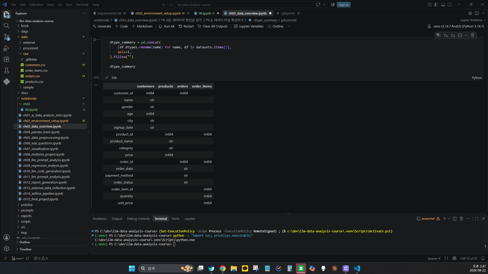
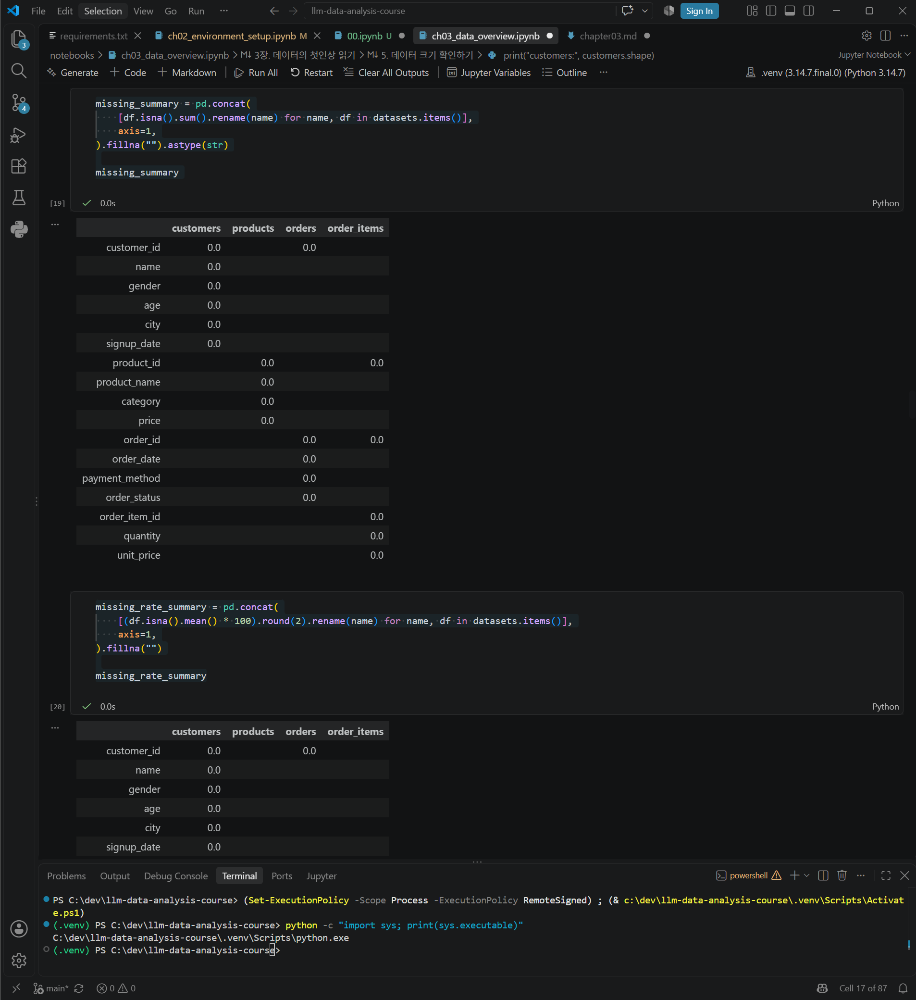
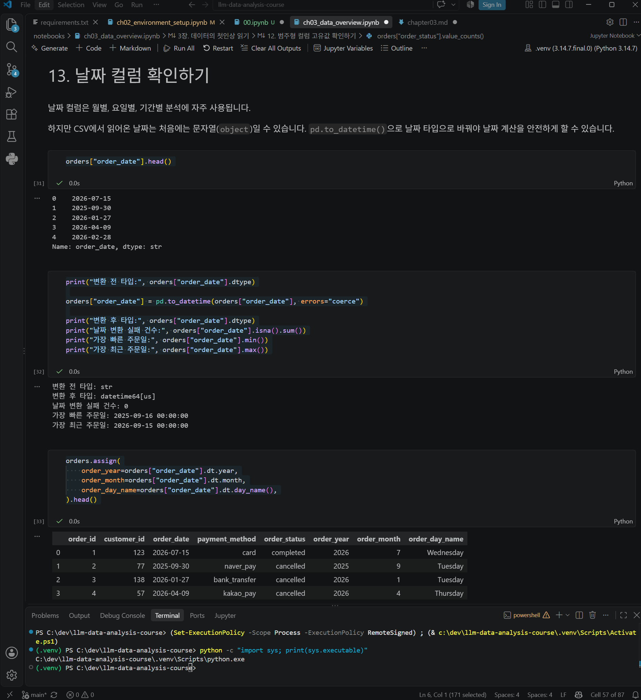
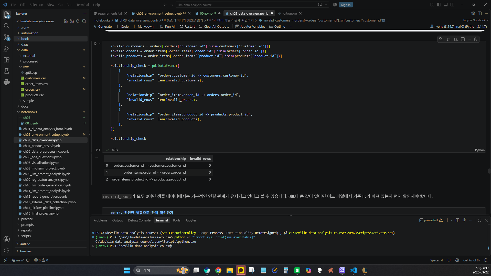
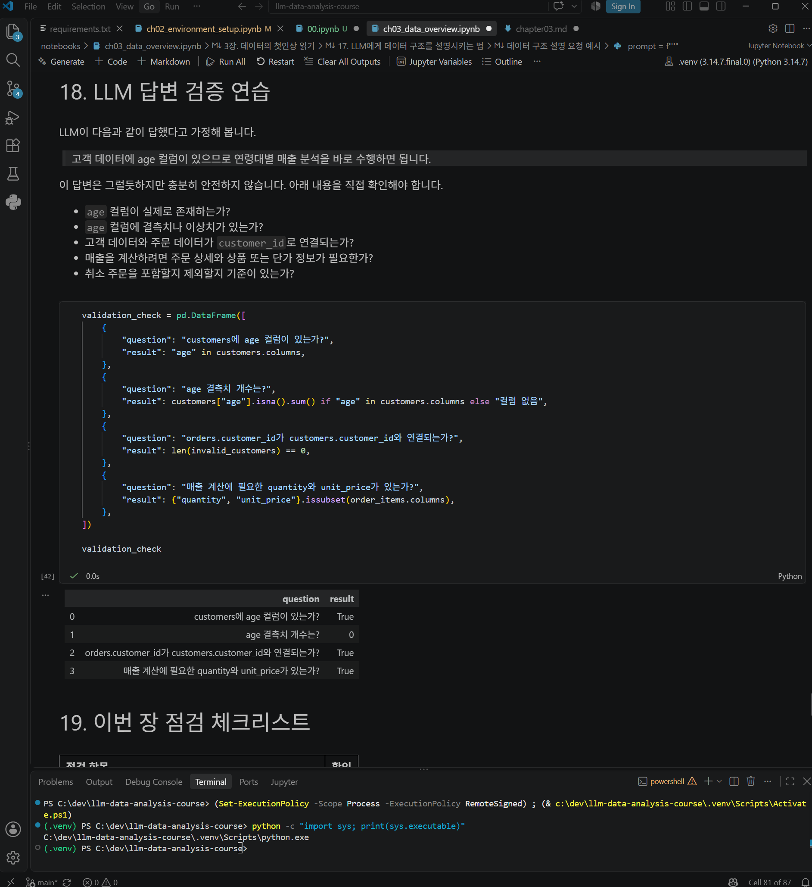

# Chapter 03 제출 답안 양식. 데이터의 첫인상 읽기

> 주 제출물은 실행 완료 Notebook `chapter03/chapter03.ipynb`입니다. 이 양식의 항목을 Notebook의 Markdown 셀로 추가해 작성합니다.

## 0. 제출 정보
- 이름: 오현우
- GitHub ID: dhgusdn0312
- 작성일:2026-09-22
- 최종 제출 URL: https://github.com/dhgusdn0312/llm-data-analysis-study/blob/main/chapter03/chapter03.ipynb

## 1. 데이터 로딩과 구조 확인
### 실행/결과
- 4개 CSV 로딩 여부: 모두 정상적으로 로딩
- 각 데이터 shape:
    customers: (150, 6)
    products: (100, 4)
    orders: (300, 5)
    order_items: (764, 5)
- 주요 컬럼:
[customers]
['customer_id', 'name', 'gender', 'age', 'city', 'signup_date']

[products]
['product_id', 'product_name', 'category', 'price']

[orders]
['order_id', 'customer_id', 'order_date', 'payment_method', 'order_status']

[order_items]
['order_item_id', 'order_id', 'product_id', 'quantity', 'unit_price']

- dtypes에서 주목한 컬럼:
    customers.signup_date: str
    orders.order_date: str
    age, price, quantity, unit_price: int64

### Evidence

### 결과 관찰
CSV 파일을 정상적으로 로딩하였고 pandas dataframe으로 확인하였다. shape를 통해 각 파일들의 행과 열들을 파악하였다. 항목들을 보면 파일들에서 공통으로 사용하는 컬럼들이 존재하는 것을 확인하였다.

### 나의 해석과 판단
order item의 행 수가 order보다 많게 나왔다. 이것은 한 주문에서 여러 상품들이 포함될 수 있어서일 것이다.
그리고 signup_date와 order_date는 info를 통해 보았을 때 문자열 타입임을 확인했다. 날짜로 변경이 가능한지 확인이 필요하다.

### 업무·분석적 의미
 데이터 구조를 먼저 확인하지 않으면 어떤 컬럼을 이용해 파일들을 연결해야 하는지 알기 어렵다.
또한 문자, 숫자, 날짜 등의 데이터 타입을 제대로 파악하지 못하면 계산이나 날짜 분석 과정에서 오류가 발생할 수 있다.

### 한계와 추가 확인 사항
이 단계에서는 데이터의 구조와 타입만 확인했기 때문에 결측치, 전체 행 중복, 주요 ID의 중복 여부와 날짜 컬럼의 실제 변환 가능 여부는 아직 판단할 수 없다.

## 2. 결측·중복·키 품질
- 주요 ID 결측: 확인한 컬럼에서 결측치 0건
- 주요 ID 중복:
    customers.customer_id: 0건
    products.product_id: 0건
    orders.order_id: 0건
    order_items.order_id: 464건
- 전체 행 중복:
    customers: 0건
    products: 0건
    orders: 0건
    order_items: 0건

### 결과 관찰
4개 데이터셋의 결측치를 확인한 결과 각 컬럼에서 결측치는 발견되지 않았다.
또한 전체 행 중복도 4개 데이터셋 모두 0건이었다.
customer_id, product_id, orders의 order_id는 중복이 0건이었고,
order_items의 order_id는 464건의 중복이 확인되었다.

### 나의 해석과 판단
order_items의 order_id가 반복되어 있지만 이를 바로 중복 오류라고 판단하면 안 된다.
한 주문에 여러 상품이 포함될 수 있기 때문에 동일한 order_id가 여러 주문 상세 행에 존재할 수 있기 때문이다.
따라서 중복을 확인할 때는 단순히 값이 반복되는지만 볼 것이 아니라
해당 컬럼이 고유 ID인지 파일을 연결하기 위한 ID인지 먼저 확인해야 한다.

### 업무·분석적 의미
결측치나 중복 데이터를 확인하지 않고 분석하면 일부 데이터가 빠지거나 같은 데이터를 여러 번 계산하여 결과가 달라질 수 있다.
또한 정상적으로 반복되는 ID를 중복 오류로 판단해 삭제하면 실제 주문 정보가 손실될 수 있다.

### 한계와 추가 확인 사항
현재까지는 결측치와 전체 행 중복 문제는 확인되지 않았다.
하지만 order_items의 각 행을 구분하는 order_item_id가 모두 고유한지는 추가 확인이 필요하다.

## 3. 숫자형·범주형·날짜 점검
- 숫자형 범위에서 주목한 값: age, price, quantity, unit_price
- 범주형 빈도에서 주목한 값: city, category, order_status
- 날짜 변환 실패 건수: 0건
- 날짜 범위: 2025-09-16 ~ 2026-09-15

### 결과 관찰
숫자형 컬럼의 범위를 확인한 결과 age는 19~69, price는 5,000~200,000, quantity는 1~5, unit_price는 5,000~200,000으로 확인되었다.
order_status는 completed 184건, cancelled 64건, refunded 52건으로 확인되었다.
order_date는 문자열 타입이었어서 날짜 타입으로 변환하였고, 변환 실패는 0건이었다.
주문 데이터의 기간은 2025년 9월 16일부터 2026년 9월 15일까지였다.

### 나의 해석과 판단
확인한 숫자형 범위에서는 음수 가격이나 수량이 0 이하인 값과 같이 바로 이상하다고 볼 수 있는 값은 보이지 않았다.
하지만 숫자의 범위가 정상적으로 보인다고 해서 실제 업무 기준에도 정상이라고 바로 판단할 수는 없다. 가격이나 수량이 실제로 가능한 값인지 확인하려면 상품이나 주문에 대한 업무 기준도 함께 확인할 필요가 있다.
또한 주문 상태에 cancelled와 refunded가 있기 때문에 이후 매출 분석을 할 때 어떤 주문 상태를 포함할 것인지 기준을 정해야 한다.

### 업무·분석적 의미
숫자형 데이터의 범위와 범주형 값의 종류를 미리 확인하면 비정상적인 값이나 예상하지 못한 상태값을 발견할 수 있다.
또한 날짜를 정상적으로 변환하고 분석 기간을 확인해야 월별이나 기간별 분석을 정확하게 할 수 있다.

### 한계와 추가 확인 사항
cancelled와 refunded 주문을 실제 매출 계산에서 어떻게 처리해야 하는지는 추가로 기준을 정할 필요가 있다.

## 4. CSV 간 키 관계 검증
- 없는 `customer_id`: 0건
- 없는 `order_id`: 0건
- 없는 `product_id`: 0건

### 결과 관찰
orders.customer_id와 customers.customer_id를 비교한 결과 연결되지 않는 값은 0건이었다.
order_items.order_id와 orders.order_id를 비교한 결과 연결되지 않는 값은 0건이었다.
order_items.product_id와 products.product_id를 비교한 결과 연결되지 않는 값은 0건이었다.

### 나의 해석과 판단
만약 연결되지 않는 ID가 발견되더라도 바로 삭제하기보다는 파일 누락, 데이터 타입 차이, 입력 오류 등의 원인을 먼저 확인해야 할 것이다.

### 업무·분석적 의미
파일 간 키 관계가 정상적으로 연결되어야 고객, 주문, 상품 데이터를 합쳐서 분석할 수 있다.
연결되지 않는 ID가 존재하면 병합 과정에서 일부 데이터가 빠질 수 있고, 분석 결과에도 영향을 줄 수 있다.

### 한계와 추가 확인 사항
이번 확인에서는 자식 테이블의 ID가 부모 테이블에 존재하는지만 확인하였다.
실제 데이터가 업무적으로 올바르게 연결되어 있는지까지는 추가 확인이 필요하다.

## 5. LLM 구조 설명 검증
- LLM에 제공한 Safe Context: 4개 데이터셋의 행과 열 개수, 컬럼명, 파일 간 관계
- LLM이 제안한 추가 점검: age 컬럼이 있으므로 연령대별 매출 분석을 수행할 수 있다고 제안하였다.
- 실제 데이터에서 확인한 항목:
customers에 age 컬럼이 존재하는지 확인하였다.
age의 결측치는 0건이었다.
orders.customer_id와 customers.customer_id가 연결되는지 확인하였다.
매출 계산에 필요한 quantity와 unit_price 컬럼이 존재하는지 확인하였다.
- 채택/수정/보류한 내용:
연령대별 분석이 가능하다는 방향은 채택하였다.
하지만 바로 매출 분석을 수행하기보다는 고객, 주문, 주문 상세 데이터의 연결 관계와 주문 상태를 먼저 확인해야 한다고 수정하였다.

### 나의 해석과 판단
LLM의 제안에서 실제 분석 전에 어떤 내용을 확인해야 하는지 생각해 볼 수 있다는 점은 유용했다.

하지만 컬럼이 존재한다는 이유만으로 바로 분석이 가능하다고 판단하면 안 된다고 생각했다.
실제 데이터의 결측치와 키 관계를 확인하고, cancelled와 refunded 같은 주문 상태를 매출 분석에서 어떻게 처리할지도 정해야 한다.

### 한계와 추가 확인 사항
LLM은 제공한 데이터 구조만을 기준으로 답변하기 때문에 실제 데이터의 상태까지 알 수 없다.
따라서 LLM이 제안한 내용은 실제 데이터와 비교하여 직접 확인해야 한다.

## 6. Chapter 03 최종 판단
### 데이터의 첫인상 3가지
1. 4개의 CSV 파일들이 정상적으로 로딩이 되었고 구조를 먼저 파악했을 때 파일들을 연결할 수 있는 컬럼들이 있었다.
2. 결측치와 전체 행 중복은 확인되지 않았다. 파일 간 키 관계에서도 연결되지 않는 값은 없었다.
3. order_date는 문자열 타입이었지만 날짜 타입으로 변환할 수 있었고, 변환 실패는 0건이었다.

### 다음 Chapter 전에 반드시 확인/처리해야 할 항목
1. cancelled와 refunded 주문을 이후 매출 분석에서 어떻게 처리할지 기준을 정해야 한다.
2. 날짜 분석을 위해 order_date와 같은 날짜 컬럼을 날짜 타입으로 변환해서 사용해야 한다.
3. order_items의 order_id처럼 반복될 수 있는 연결용 ID와 고유해야 하는 ID를 구분해서 분석해야 한다.

### 현재 데이터만으로 단정할 수 없는 것
현재 확인한 범위에서는 데이터 구조와 기본적인 품질에 큰 문제는 보이지 않았다.
하지만 숫자형 값들이 실제 업무 기준에서도 모두 정상적인 값인지, cancelled와 refunded를 실제 매출에 어떻게 반영해야 하는지는 현재 데이터만으로 단정할 수 없다.

## 최종 제출 체크
- [O] Notebook을 처음부터 끝까지 실행했습니다.
- [O] 오류 셀이 남아 있지 않습니다.
- [O] 핵심 Evidence를 첨부했습니다.
- [O] 관찰과 해석을 구분했습니다.
- [O] 개인정보/Secret이 없습니다.
- [O] `chapter03/chapter03.ipynb`가 GitHub에서 정상 표시됩니다.
- [O] 최종 Notebook 파일 URL을 제출합니다.